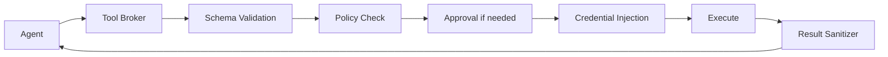

# Department 03 — Tool System & MCP

> **职责**：Tool Broker 是 Agent 与所有外部能力之间的唯一桥梁 — 所有工具调用都经过这里。统一管理 Native Connectors 和 MCP Servers 的发现、注册、Schema 验证、执行、结果清洗。
> **优先级**：P0（Foundation）
> **预估规模**：L
> **负责目录**：`packages/tool_broker/` + `mcp/`

---

## 1. 部门边界

### 你负责
- `ToolDescriptor` — 统一的工具描述 Schema
- `ToolRegistry` — 工具的注册、发现、查询
- `ToolBroker` — 工具调用的统一入口（Schema 验证 → Policy Check → Credential Injection → Execute → Result Sanitize）
- Tool Namespace Router — 按意图选择相关工具（避免 200 个 tool schema 全发给 LLM）
- MCP Manager — MCP Server 注册、连接管理、Capability Cache、OAuth、Tool Normalizer、Trust Registry
- `Connector` Protocol — 定义连接器必须实现的接口
- `ToolResult` / `ToolExecutionContext` — 统一返回和执行上下文

### 你不负责
- Policy 的具体判断逻辑 → Department 04
- Credential 的具体注入逻辑 → Department 04
- 具体 Connector 的实现 → Department 09
- Sandbox 管理 → Department 04
- Audit Log 写入 → Department 11

### 你的上游依赖
- Policy Engine（Department 04）— 判断 allow/ask/deny
- Credential Broker（Department 04）— 注入凭据
- Connectors（Department 09）— 实际执行工具

### 你提供给下游
- `ToolBroker.execute()` — Agent Runtime 调用工具的唯一入口
- `ToolRegistry.list_tools()` — 为 Context Engine 提供可用工具列表
- `ToolRegistry.search(query)` — Tool Namespace Router 按需查询

---

## 2. ToolDescriptor（核心数据结构）

```python
from pydantic import BaseModel
from typing import Literal

class ToolDescriptor(BaseModel):
    name: str           # e.g. "github.search_repositories"
    namespace: str      # e.g. "github" | "calendar" | "filesystem" | "mcp"

    description: str    # 用于 LLM tool selection（简洁描述功能）
    input_schema: dict  # JSON Schema 2020-12
    output_schema: dict | None  # 可选，用于验证返回结果

    source: Literal["native", "mcp", "plugin", "sandbox"]
    source_ref: str | None  # MCP server id 或 connector id

    # Risk
    risk_level: int  # R0(0) ~ R4(4)
    side_effect: bool       # 是否改变外部状态
    destructive: bool       # 是否可破坏数据
    external_write: bool    # 是否向外部系统写入
    idempotent: bool        # 重复调用是否安全

    # Auth
    credential_scope: list[str]  # e.g. ["gmail.read", "calendar.write"]

    # Execution
    timeout_seconds: int  # 默认超时
    retry_policy: str | None  # "none" | "backoff" | "once"

    # Metadata
    tags: list[str]  # 用于 Tool Namespace Router 的语义匹配
    version: str
```

---

## 3. ToolRegistry

```python
class ToolRegistry:
    """所有工具的注册中心"""

    async def register(self, tool: ToolDescriptor) -> None:
        """注册一个工具（幂等）"""
        ...

    async def unregister(self, name: str) -> None:
        """移除一个工具"""
        ...

    async def get(self, name: str) -> ToolDescriptor:
        """按 name 查找"""
        ...

    async def list_all(self) -> list[ToolDescriptor]:
        """列出所有可用工具"""
        ...

    async def list_by_namespace(self, namespace: str) -> list[ToolDescriptor]:
        """按 namespace 过滤"""
        ...

    async def search(
        self,
        query: str,
        risk_max: int = 4,
        limit: int = 15,
    ) -> list[ToolDescriptor]:
        """
        语义搜索相关工具（用于 Tool Namespace Router）。
        实现方式：embedding search over tool descriptions + tags
        """
        ...

    async def list_for_llm(
        self,
        query: str | None = None,
        risk_max: int = 4,
        namespace_filter: list[str] | None = None,
    ) -> list[dict]:
        """
        返回可直接注入 LLM tool_choice 的简化 schema 列表。
        只包含 name, description, input_schema。
        """
        ...
```

---

## 4. ToolBroker（核心执行引擎）



### ToolBroker 接口

```python
class ToolExecutionContext(BaseModel):
    run_id: UUID
    session_id: UUID
    owner_id: UUID
    agent_id: UUID
    idempotency_key: str
    approved_by: UUID | None  # 如果有审批，记录审批人
    approval_id: UUID | None

class ToolResult(BaseModel):
    success: bool
    data: dict | None
    error: str | None
    error_code: str | None
    latency_ms: int
    truncated: bool  # 结果是否被截断
    sanitized: bool  # 结果是否被清洗

class ToolBroker:
    def __init__(
        self,
        registry: ToolRegistry,
        policy_engine,   # PolicyEngine protocol (Dept 04)
        credential_broker,  # CredentialBroker protocol (Dept 04)
        connectors: dict[str, Connector],  # name → Connector
    ):
        ...

    async def execute(
        self,
        tool_name: str,
        arguments: dict,
        context: ToolExecutionContext,
    ) -> ToolResult:
        """
        完整执行流程：
        1. lookup tool in registry
        2. validate arguments against input_schema
        3. call policy_engine.evaluate(tool, arguments, context)
        4. if "deny" → return error
        5. if "ask" → raise ApprovalRequired (caught by Runtime → HITL)
        6. if "allow" → inject credentials → execute → sanitize → return
        """
        ...

    async def list_available_tools(
        self,
        owner_id: UUID,
        query: str | None = None,
    ) -> list[ToolDescriptor]:
        """返回当前用户可用且通过 policy 初筛的工具"""
        ...

    async def test_tool(
        self,
        tool_name: str,
        arguments: dict,
        owner_id: UUID,
    ) -> ToolResult:
        """Dry-run 测试工具（不经过完整 policy check，返回 preview）"""
        ...
```

### ToolBroker 的 10 大职责

1. **Schema Validation** — 用 `input_schema` 校验参数
2. **Policy Check** — 调用 Policy Engine 判断 allow/ask/deny
3. **Approval Handling** — 需要 ask 时暂停等待 Approval
4. **Credential Injection** — 调用 Credential Broker 注入 secret ref
5. **Sandbox Selection** — 需要隔离的工具路由到 Sandbox
6. **Timeout** — 超时中断
7. **Retry** — 按 tool.retry_policy 重试
8. **Result Size Limit** — 超长结果截断
9. **Result Sanitization** — 移除 secret/credential 泄漏
10. **Audit** — 发送 `tool.call` 事件到 Event Bus

---

## 5. Tool Namespace Router

一个常见问题是：Tools 越多，System Prompt 越大。不要每轮把 200 个 tool schema 都发给 LLM。

```text
User Query "明天有什么安排？"
    ↓
Tool Namespace Router（快速 embedding search）
    ↓
匹配: calendar.*, time.*, memory.search
    ↓
只加载 5-15 个相关 tool schema 注入 LLM prompt
```

### 实现方式
- MVP：基于 tool tags + description 的简单关键词匹配
- 后续：embedding search（用轻量 embedding model 提前索引所有 tool description）

---

## 6. MCP Manager

MCP 在本系统中定位为 **Capability Protocol**，不是 Agent Framework。

### 架构

```text
MCP Manager
├── Server Registry    — 注册所有 MCP Server
├── Connection Manager — 管理 stdio/HTTP/SSE 连接
├── Capability Cache   — 缓存每个 Server 的 tool list
├── OAuth Manager      — 处理 MCP 的 OAuth 2.0 流程
├── Tool Normalizer    — 将 MCP Tool → ToolDescriptor
└── Trust Registry     — 每个 Server 的信任级别和工具白名单
```

### Trust Registry（每个 Server 必须配置）

```yaml
server:
  id: github
  transport: http
  trust: trusted  # trusted | untrusted | verified

  allowed_tools:
    - search_repositories
    - read_issue
    - list_commits

  denied_tools:
    - delete_repository
    - transfer_repository
```

**重要安全原则**：Tool annotations 只有来自可信 Server 时才被信任。风险等级来自本地 Policy，不是 MCP Tool Annotation。

### MCP Server 注册模型

```sql
CREATE TABLE mcp_servers (
    id UUID PRIMARY KEY DEFAULT gen_random_uuid(),
    owner_id UUID NOT NULL REFERENCES users(id),

    name TEXT NOT NULL,
    transport TEXT NOT NULL,  -- stdio | http | sse
    endpoint TEXT,            -- HTTP URL or command
    trust TEXT NOT NULL DEFAULT 'untrusted',  -- trusted | untrusted | verified

    allowed_tools JSONB NOT NULL DEFAULT '[]',
    denied_tools JSONB NOT NULL DEFAULT '[]',

    credential_ref TEXT,      -- 指向 credentials_refs 表

    status TEXT NOT NULL DEFAULT 'disconnected',

    last_connected_at TIMESTAMPTZ,
    created_at TIMESTAMPTZ NOT NULL DEFAULT now()
);
```

---

## 7. 不要第一版实现的功能

- ❌ 自动发现远程 MCP Server（第一版手动注册）
- ❌ MCP Tasks 协议支持（等规范稳定）
- ❌ Agent 自动安装 MCP Server（需要用户手动注册）
- ❌ 动态 tool 生成

---

## 8. 详细任务列表

### Task 1: 定义核心数据模型
- [ ] `ToolDescriptor` Pydantic model（含 validation）
- [ ] `ToolResult` / `ToolExecutionContext` model
- [ ] `Connector` Protocol 定义

### Task 2: 实现 ToolRegistry
- [ ] 内存版 `InMemoryToolRegistry`（注册、注销、查询、搜索）
- [ ] `list_for_llm()` — 生成 LLM-compatible tool schema
- [ ] `search()` — 语义搜索（MVP: 关键词匹配）

### Task 3: 实现 ToolBroker
- [ ] `execute()` 完整流程（validate → policy → credentials → execute → sanitize）
- [ ] Schema Validation（用 jsonschema 库验证 input_schema）
- [ ] Result truncation（超长结果截断到配置的最大长度）
- [ ] Result sanitization（移除 patterns like `sk-...`, `Bearer ...`）
- [ ] Timeout 处理（用 asyncio.timeout）
- [ ] 发送 `tool.call` 事件到 Event Bus

### Task 4: 实现 Tool Namespace Router
- [ ] 基于关键词/tags 的工具筛选
- [ ] 默认行为：没有 query 时返回所有 R0-R2 工具
- [ ] 高风险工具（R3-R4）只在显式匹配时返回

### Task 5: 实现 MCP Manager
- [ ] `MCP Server Registry` — 注册/注销 MCP Server
- [ ] `Connection Manager` — 管理 stdio/HTTP 连接生命周期
- [ ] `Tool Normalizer` — MCP Tool schema → `ToolDescriptor`
- [ ] `Trust Registry` — allowed_tools/denied_tools 过滤
- [ ] `Capability Cache` — 缓存 tool list（避免每次调用都 fetch）

### Task 6: 编写测试
- [ ] ToolRegistry 单元测试
- [ ] ToolBroker mock 测试（mock policy/credential/connector）
- [ ] Schema validation 测试（valid arguments / invalid arguments）
- [ ] Tool Namespace Router 正确性测试

---

## 9. 验收标准

### ToolBroker 完整流程测试
```python
# 工具注册
registry.register(ToolDescriptor(name="calculator", risk_level=0, ...))

# 执行（R0 工具 auto-allow）
result = await broker.execute("calculator", {"expression": "2+2"}, ctx)
assert result.success and result.data["result"] == 4

# 执行（R3 工具触发 approval）
result = await broker.execute("email.send", {...}, ctx)
# → 抛出 ApprovalRequired，等待 HITL
```

### MCP 工具集成测试
```text
注册 GitHub MCP Server（transport: http, trust: trusted）
    ↓
Tool Normalizer 将 MCP tools 转为 ToolDescriptors
    ↓
ToolRegistry.list_all() 包含 github.* 工具
    ↓
ToolBroker.execute("github.search_repositories", ...) → 成功
```

---

## 10. 参考蓝图章节

- Section 14: Tool Architecture（ToolDescriptor）
- Section 15: Tool Broker
- Section 16: MCP 设计
- Section 17: Tool Risk Model
- Section 25: Connector Contract
- Section 35: Tool Selection Optimization
- Section 39: Tool Call Schema
